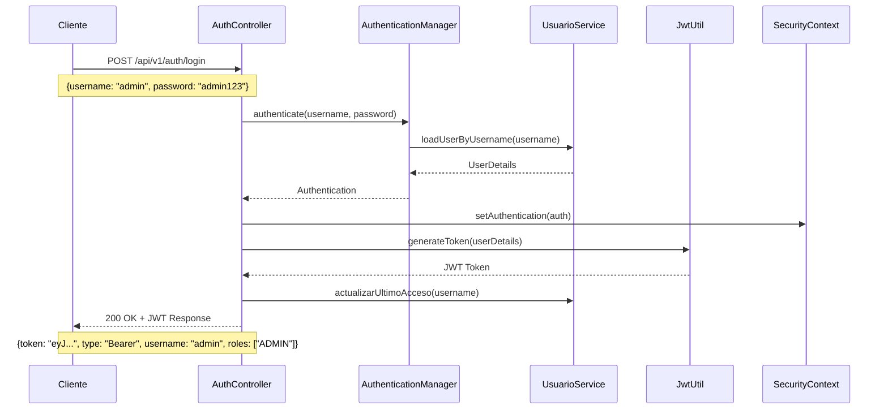
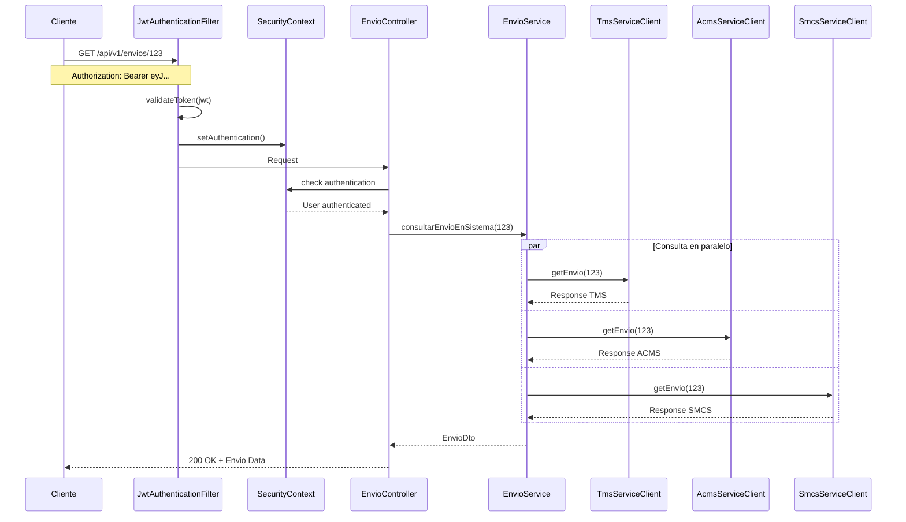
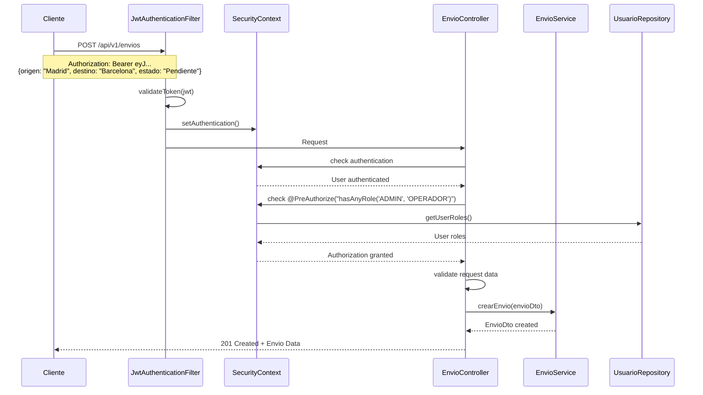
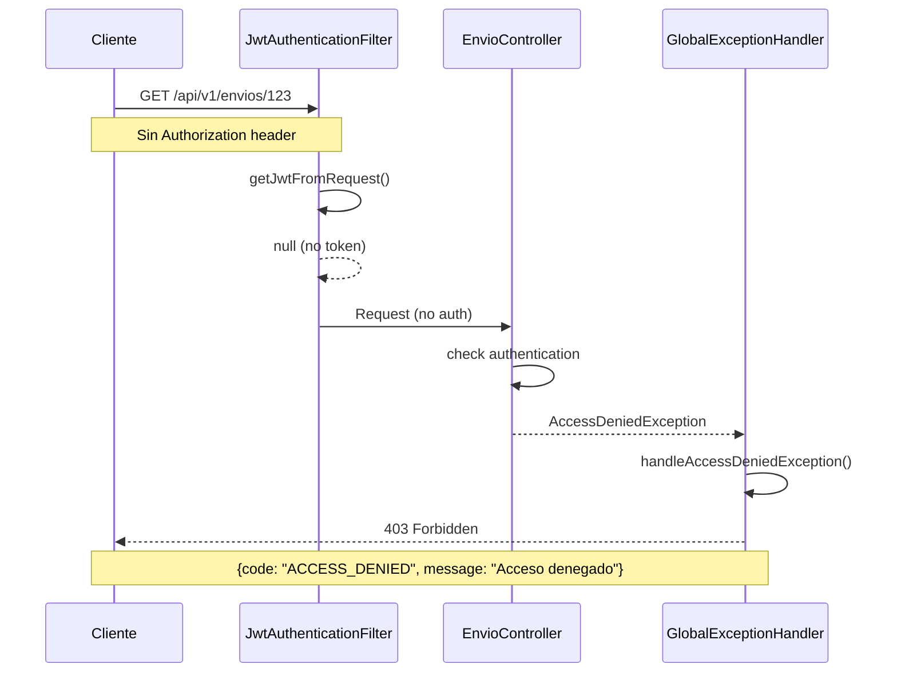
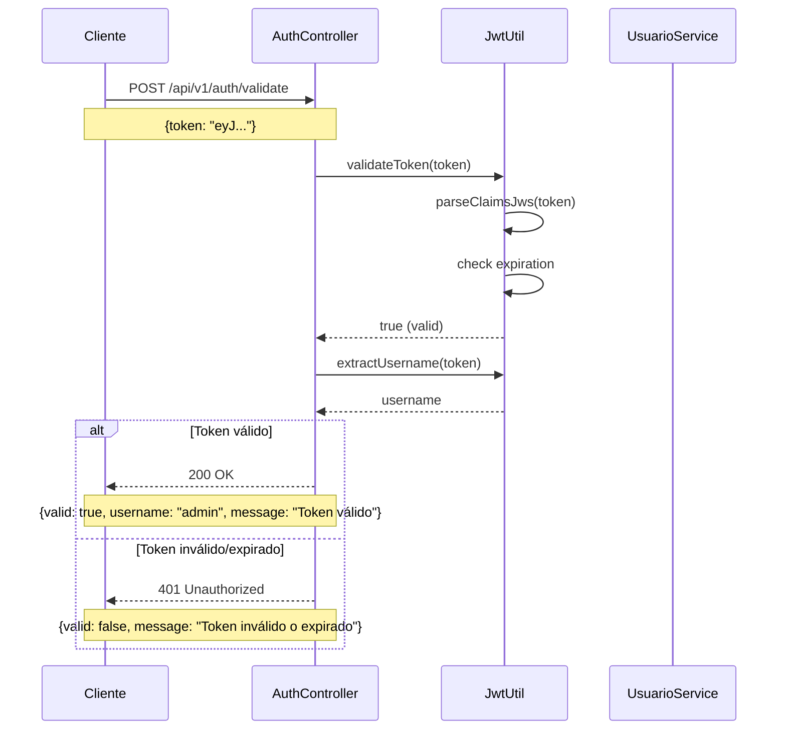
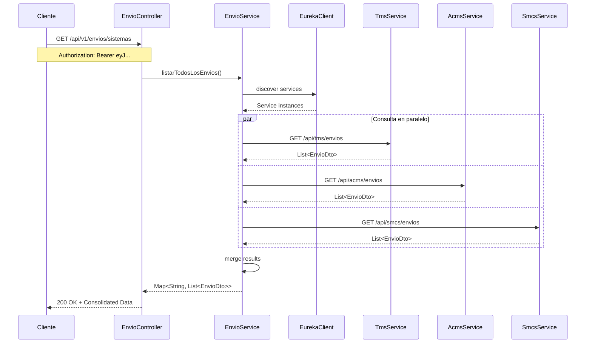
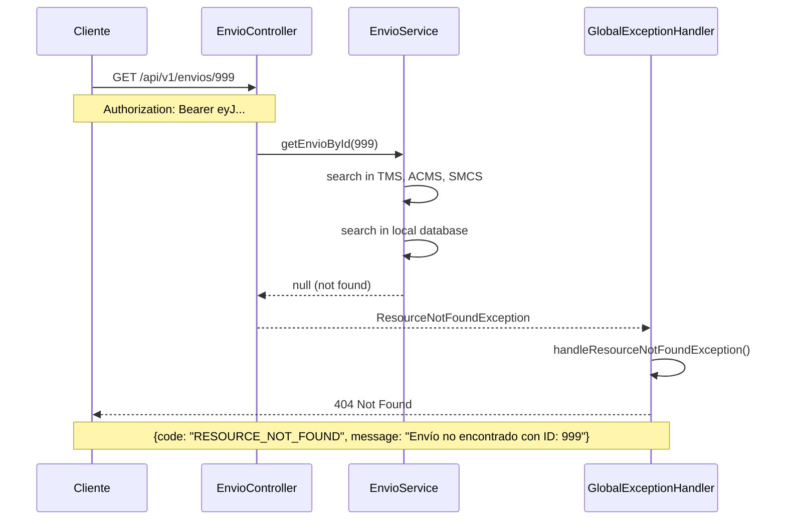
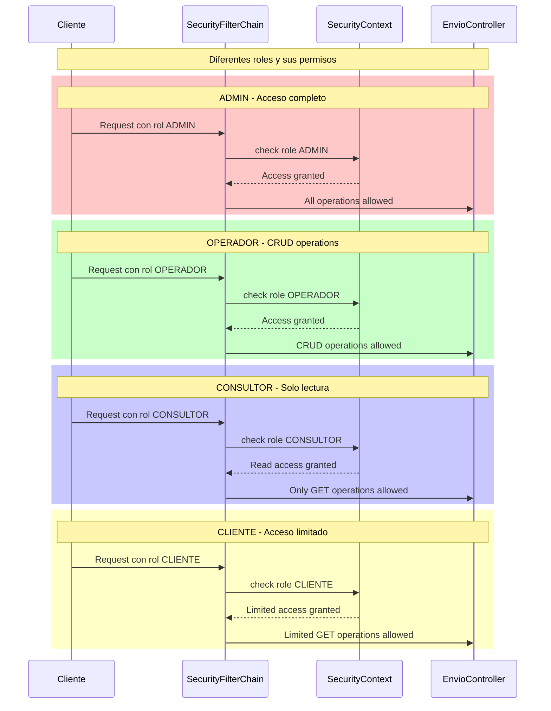

# Diagramas de Secuencia UML - LogiServices

## 1. Diagrama de Autenticación JWT

## 2. Diagrama de Consulta de Envío con Autenticación

## 3. Diagrama de Creación de Envío (Solo ADMIN/OPERADOR)

## 4. Diagrama de Error de Autenticación

## 5. Diagrama de Validación de Token

## 6. Diagrama de Integración con Servicios Externos

## 7. Diagrama de Manejo de Excepciones

## 8. Diagrama de Roles y Permisos

## Resumen de Códigos de Error

| Código | Descripción | Cuándo ocurre |
|--------|-------------|---------------|
| 200 | OK | Operación exitosa |
| 201 | Created | Recurso creado exitosamente |
| 400 | Bad Request | Datos de entrada inválidos |
| 401 | Unauthorized | No autenticado o token inválido |
| 403 | Forbidden | Sin permisos para la operación |
| 404 | Not Found | Recurso no encontrado |
| 500 | Internal Server Error | Error interno del servidor |
| 503 | Service Unavailable | Error de integración con servicios externos |

## Flujo de Autenticación Resumido

1. **Login**: Cliente envía credenciales → Recibe JWT token
2. **Request**: Cliente incluye token en header Authorization
3. **Validation**: Filtro JWT valida token y establece autenticación
4. **Authorization**: Spring Security verifica permisos del usuario
5. **Response**: Operación ejecutada o error devuelto
